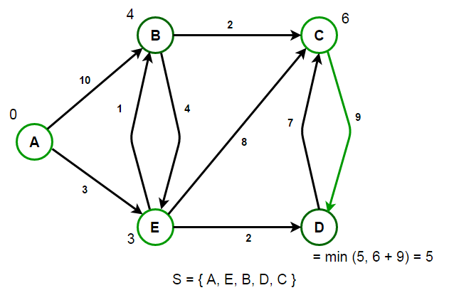

## Dijkstra's shortest-path algorithm
**Problem**
Given a source vertex s from set of vertices V in a weighted graph where all its edge weights w(u, v) are non-negative, find the shortest-path weights d(s, v) from given source s for all vertices v present in the graph.

For example,  
  
Path from vertex A to vertex B has min cost of 4 & the route is \[ A -> E -> B \]  
Path from vertex A to vertex C has min cost of 6 & the route is \[ A -> E -> B -> C \]  
Path from vertex A to vertex D has min cost of 5 & the route is \[ A -> E -> D \]  
Path from vertex A to vertex E has min cost of 3 & the route is \[ A -> E \]  


We know that breadth-first search can be used to find shortest path in an unweighted graph or even in weighted graph having same cost of all its edges. But if edges in the graph are weighted with different costs, then BFS generalizes to _uniform-cost search_. Now instead of expanding nodes in order of their depth from the root, uniform-cost search expands the nodes in order of their cost from the root. A variant of this algorithm is known as Dijkstra’s algorithm.

Dijkstra’s Algorithm is an algorithm for finding the shortest paths between nodes in a graph. For a given source node in the graph, the algorithm finds the shortest path between that node and every other node. It can also be used for finding the shortest paths from a single node to a single destination node by stopping the algorithm once the shortest path to the destination node has been determined.

Dijkstra’s Algorithm is based on the principle of relaxation, in which an approximation to the correct distance is gradually replaced by more accurate values until shortest distance is reached. The approximate distance to each vertex is always an overestimate of the true distance, and is replaced by the minimum of its old value with the length of a newly found path. It uses a priority queue to greedily select the closest vertex that has not yet been processed and performs this relaxation process on all of its outgoing edges.

Below is psedocode for Dijkstra’s Algorithm.
```
function Dijkstra(Graph, source)  
   
    dist\[source\] = 0    // Initialization  
    create vertex set Q  
   
    for each vertex v in Graph  
    {  
        if v != source  
        {  
            dist\[v\] = INFINITY        // Unknown distance from source to v  
            prev\[v\] = UNDEFINED       // Predecessor of v  
        }  
        Q.add\_with\_priority(v, dist\[v\])  
    }  
    while Q is not empty  
    {  
        u = Q.extract\_min()            // Remove minimum  
        for each neighbor v of u that is still in Q  
        {  
            alt = dist\[u\] + length(u, v)  
            if alt < dist\[v\] {  
                dist\[v\] = alt  
                prev\[v\] = u  
                Q.decrease\_priority(v, alt)  
            }  
        }  
    }  
    return dist\[\], prev\[\]
```
For instance, consider below graph. We will start from vertex A. So vertex A has distance 0 and remaining vertices have undefined (infinite) distance from source. Let S be the set of vertices whose shortest path distances from source are already calculated.


Initially S = {} and we push source vertex to it. S = {A}.  
We start from source vertex A and start relaxing A’s neighbors. Since vertex B can be reached from a direct edge from vertex A, we update its distance to 10 (weight of edge A-B). Similarly vertex E can be reached through a direct edge from A, so we update its distance from infinity to 3.


After processing all outgoing edges of A, we next consider vertex having minimum distance. B has distance of 10, E has distance 3 and all remaining vertices have distance infinity. So we choose E and push it into the Set S. Now our set becomes S = {A, E}. Next we relax E’s neighbors. E has 2 neighbors B and C. We have already found one route to vertex B through vertex A having cost 10. But if we visit vertex B through vertex E, we are getting even a cheaper route. i.e (cost of edge A-E + cost of edge E-B)= 3 + 1 = 4 < 10 (cost of edge A-B).


We repeat the process till we have processed all the vertices. i.e Set S become full





Dijkstra’s algorithm runs in **O(E log V)** time like Prim’s algorithm. Here **E** is the number of edges and **V** is number of vertices in the graph.
