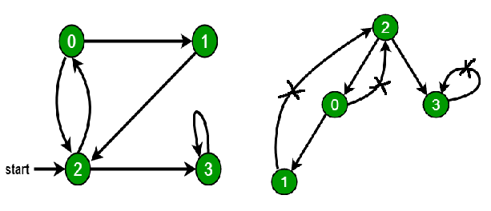

Depth First Search
==================
Depth First Traversal (or Search) for a graph is similar to Depth First Traversal of a tree. The only catch here is, unlike trees, graphs may contain cycles, so we may come to the same node again. To avoid processing a node more than once, we use a boolean visited array.

For example, in the following graph, we start traversal from vertex 2. When we come to vertex 0, we look for all adjacent vertices of it. 2 is also an adjacent vertex of 0. If we don’t mark visited vertices, then 2 will be processed again and it will become a non-terminating process. A Depth First Traversal of the following graph is 2, 0, 1, 3.

Applications
============
1. For a weighted graph, DFS traversal of the graph produces the minimum spanning tree and all pair shortest path tree.
2. **Detecting cycle in a graph**  
A graph has cycle if and only if we see a back edge during DFS. So we can run DFS for the graph and check for back edges. (See [this](http://people.csail.mit.edu/thies/6.046-web/recitation9.txt) for details)

3. **Path Finding**  
We can specialize the DFS algorithm to find a path between two given vertices u and z.  
i) Call DFS(G, u) with u as the start vertex.  
ii) Use a stack S to keep track of the path between the start vertex and the current vertex.  
iii) As soon as destination vertex z is encountered, return the path as the  
contents of the stack
4. **Topological Sorting**  
Topological Sorting is mainly used for scheduling jobs from the given dependencies among jobs. In computer science, applications of this type arise in instruction scheduling, ordering of formula cell evaluation when recomputing formula values in spreadsheets, logic synthesis, determining the order of compilation tasks to perform in makefiles, data serialization, and resolving symbol dependencies in linkers.
5. **To test if a graph is bipartite**  
We can augment either BFS or DFS when we first discover a new vertex, color it opposited its parents, and for each other edge, check it doesn’t link two vertices of the same color. The first vertex in any connected component can be red or black!
6. **Finding Strongly Connected Components of a graph** A directed graph is called strongly connected if there is a path from each vertex in the graph to every other vertex. 
7. **Solving puzzles with only one solution**, such as mazes. DFS can be adapted to find all solutions to a maze by only including nodes on the current path in the visited set. 
