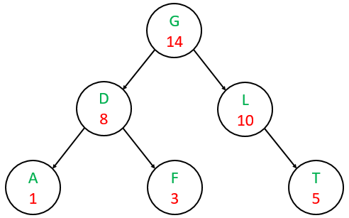

# Randomized Search Tree
The RST is a special type of Binary Search Tree called a Treap ("Tree" + "Heap"). Formally, a Treap is a binary tree in which nodes contain two items, a key and a priority, and which must obey the following two restrictions:
1. The tree must follow the Binary Search Tree properties with respect to its keys
2. The tree must follow the Heap Property with respect to its priorities

A RST is a Treap where we only supply a key and the priority for the new (key, priority) pair is randomly generated for.

Below is an example of a valid Treap where keys are letters, with alphabetic ordering, and priorities are integers, with numeric ordering (i.e., for the purpose of this lesson, the higher integer value will always have higher priority):



Given a set of (key, priority) pairs, where all keys are unique, we can easily construct a valid Treap containing the given pairs (assuming we know in advance all of the elements so that we can sort them and insert them all at once):
* Start with an empty Binary Search Tree
* Insert the (key, priority) pairs in decreasing order of priority, using the regular Binary Search Tree insertion algorithm with respect to the keys
* The resulting BST is a Treap: the BST ordering of the keys is enforced by the BST insertion algorithm, and the Heap Property of the priorities is enforced by inserting pairs in descending order of priorities

Finding a key in a Treap is completely identical to the "find" algorithm of a typical BST.

The first step to inserting a (key, priority) pair is to use the typical BST insertion algorithm (with the key of the pair). After the BST insertion, the resulting tree will be valid with respect to key ordering and bubble up to fix the priority ordering using AVL rotation.
```
AVLRight(b): // Perform a right AVL rotation on node b
    a = left child of b
    y = right child of a (or NULL if a does not have a right child)
    p = parent of b (or NULL if b does not have a parent)
    if p is not NULL and b is the right child of p:
        make a the right child of p
    otherwise, if p is not NULL and b is the left child of p:
        make a the left child of p
    make y the left child of b
    make b the right child of a

AVLLeft(a): // Perform a left AVL rotation on node a
    b = right child of a
    y = left child of b (or NULL if b does not have a left child)
    p = parent of a (or NULL if a does not have a parent)
    if p is not NULL and a is the right child of p:
        make b the right child of p
    otherwise, if p is not NULL and a is the left child of p:
        make b the left child of p
    make y the right child of a
    make a the left child of b
```

The overall time complexity of the Treap insertion is _**O(h)**_, where _**h**_ is the height of the Treap.

The find, insert, and remove operations for Treap can be described as:
```
find(key):
    perform BST find based on key
```
```
insert(key, priority):
    // Step 1: BST Insertion Algorithm
    node = (key, priority)
    perform BST insertion based on key

    // Step 2: Fix Heap Property via Bubble Up
    while node is not root and node.priority > node.parent.priority:
        if node is left child of node.parent:
            perform right AVL rotation on node.parent
        else:
            perform left AVL rotation on node.parent
```
```
remove(key):
    // Step 1: BST Removal Algorithm
    perform BST removal based on key
    node = node that was moved as a result of BST removal (i.e., the successor of key)
    if Heap Property is not violated:
        return

    // Step 2: Fix Heap Property if necessary by Trickling Down
    while node is not a leaf and node.priority < either of its children's priorities:
        if node.leftChild.priority < node.rightChild.priority:
            perform left AVL rotation on node
        else:
            perform right AVL rotation on node
```

RSTs have _**O(n)**_ worst-case complexity and _**O(log n)**_ average-case complexity.